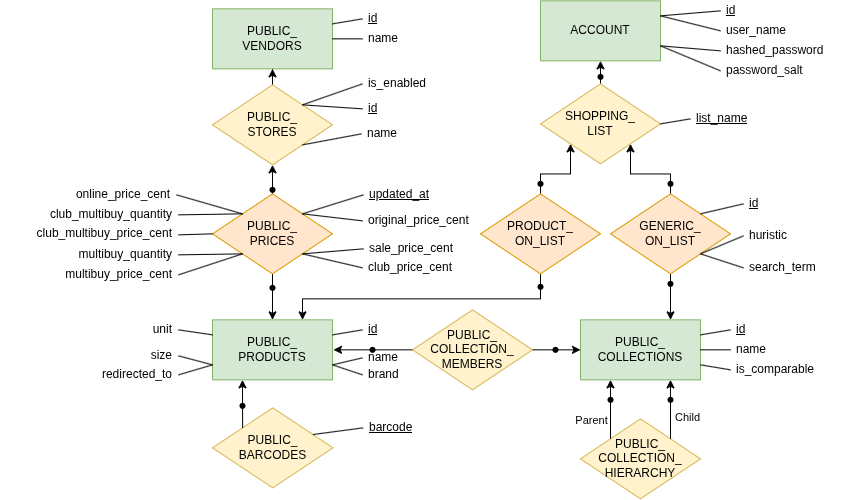

## Extended Entity Relation Diagram (EER diagram)


## Entity Relation Schema (ER schema)

- These follow the format of 
```
ENTITY_OR_RELATION_NAME = ({<set of attributes>},{<set of attributes that make up the primary key>})
```

#### Level 0 (Green) 
PUBLIC_VENDORS = ({id,name},{id})

PUBLIC_PRODUCTS = ({id, name, brand, unit, size},{id})

PUBLIC_COLLECTIONS = ({id, name, is_comparable},{id})

ACCOUNT = ({id, account_name,hashed_password,password_salt},{id})

#### Level 1 (Yellow)
PUBLIC_BARCODES =  ({barccode, PUBLIC_PRODUCTS},{barccode, PUBLIC_PRODUCTS})

PUBLIC_STORES =  ({id, PUBLIC_VENDORS,is_enabled,name},{id, PUBLIC_VENDORS})

SHOPPING_LIST =  ({list_name, ACCOUNT},{list_name, ACCOUNT})

PUBLIC_COLLECTION_MEMBERS =  ({PUBLIC_PRODUCTS, PUBLIC_COLLECTIONS},{PUBLIC_PRODUCTS, PUBLIC_COLLECTIONS})

PUBLIC_COLLECTION_HIERARCHY =  ({PARENT_PUBLIC_COLLECTIONS, CHILD_PUBLIC_COLLECTIONS},{PARENT_PUBLIC_COLLECTIONS, CHILD_PUBLIC_COLLECTIONS})

#### level 2 (Orange)
PUBLIC_PRICES = ({updated_at,PUBLIC_STORES,PUBLIC_PRODUCTS,original_price_cent,sale_price_cent,club_price_cent,multibuy_price_cent, multibuy_quantity,club_multibuy_price_cent, club_multibuy_quantity, online_price_cent},{updated_at,PUBLIC_STORES,PUBLIC_PRODUCTS})

PRODUCT_ON_LIST = ({SHOPPING_LIST,PUBLIC_PRODUCTS},{SHOPPING_LIST,PUBLIC_PRODUCTS})

GENERIC_ON_LIST = ({id,SHOPPING_LIST,PUBLIC_COLLECTIONS,huristic,search_term},{id,SHOPPING_LIST,PUBLIC_COLLECTIONS})


## Relational Database Schema

#### Level 0:


PUBLIC_VENDORS = {id,name} 
with minimal key {id}

PUBLIC_PRODUCTS = {id, name, brand, unit, size} 
with minimal key {id}

PUBLIC_COLLECTIONS = {id, name, is_comparable} 
with minimal key {id}

ACCOUNT = {id, account_name,hashed_password,password_salt} 
with minimal key{id}


#### Level 1:
PUBLIC_BARCODES = {barcode, product_id} 
with minimal key {barcode, product_id}
with foreign keys:
PUBLIC_BARCODES[product_id] ⊆ PUBLIC_PRODUCTS[id]

PUBLIC_STORES = {id, vendor_id, is_enabled, name} 
with minimal key {id}
with foreign keys:
PUBLIC_STORES[vendor_id] ⊆ PUBLIC_VENDORS[id]

SHOPPING_LIST = {list_name, account_id} 
with minimal key {list_name, account_id}
with foreign keys:
SHOPPING_LIST[account_id] ⊆ ACCOUNT[id]

PUBLIC_COLLECTION_MEMBERS = {collection_id, product_id} 
with minimal key {collection_id, product_id}
with foreign keys:
PUBLIC_COLLECTION_MEMBERS[product_id] ⊆ PUBLIC_PRODUCTS[id]
PUBLIC_COLLECTION_MEMBERS[collection_id] ⊆ PUBLIC_COLLECTIONS[id]


PUBLIC_COLLECTION_HIERARCHY = {parent_id, child_id} 
with minimal key {parent_id, child_id}
with foreign keys:
PUBLIC_COLLECTION_HIERARCHY[parent_id] ⊆ PUBLIC_COLLECTIONS[id]
PUBLIC_COLLECTION_HIERARCHY[child_id] ⊆ PUBLIC_COLLECTIONS[id]


#### Level 2:
PUBLIC_PRICES = {updated_at,store_id,product_id,original_price_cent,sale_price_cent,club_price_cent,multibuy_price_cent, multibuy_quantity,club_multibuy_price_cent, club_multibuy_quantity, online_price_cent} 
with minimal key {updated_at,store_id,product_id}
with foreign keys:
PUBLIC_PRICES[store_id] ⊆ PUBLIC_STORES[id]
PUBLIC_PRICES[product_id] ⊆ PUBLIC_PRODUCTS[id]

PRODUCT_ON_LIST = {shopping_list_name, account_id, product_id} 
with minimal key {shopping_list_name, account_id, product_id}
with foreign keys:
PRODUCT_ON_LIST[shopping_list_name,account_id] ⊆ SHOPPING_LIST[name,account_id]
PRODUCT_ON_LIST[product_id] ⊆ PUBLIC_PRODUCTS[id]


GENERIC_ON_LIST = {id,shopping_list_name,account_id,collection_id,huristic,search_term} 
with minimal key {id,shopping_list_name,account_id, collection_id}
with foreign keys:
GENERIC_ON_LIST[shopping_list_name,account_id] ⊆ SHOPPING_LIST[list_name,account_id]
GENERIC_ON_LIST[collection_id] ⊆ PUBLIC_COLLECTIONS[id]

